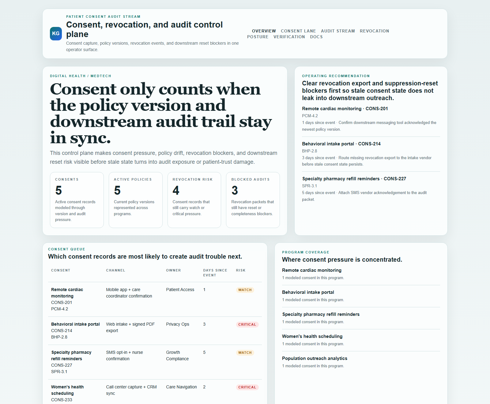
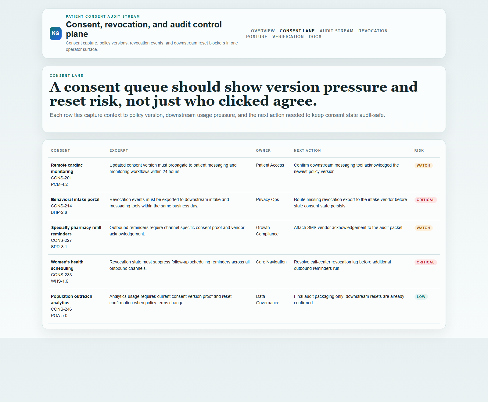
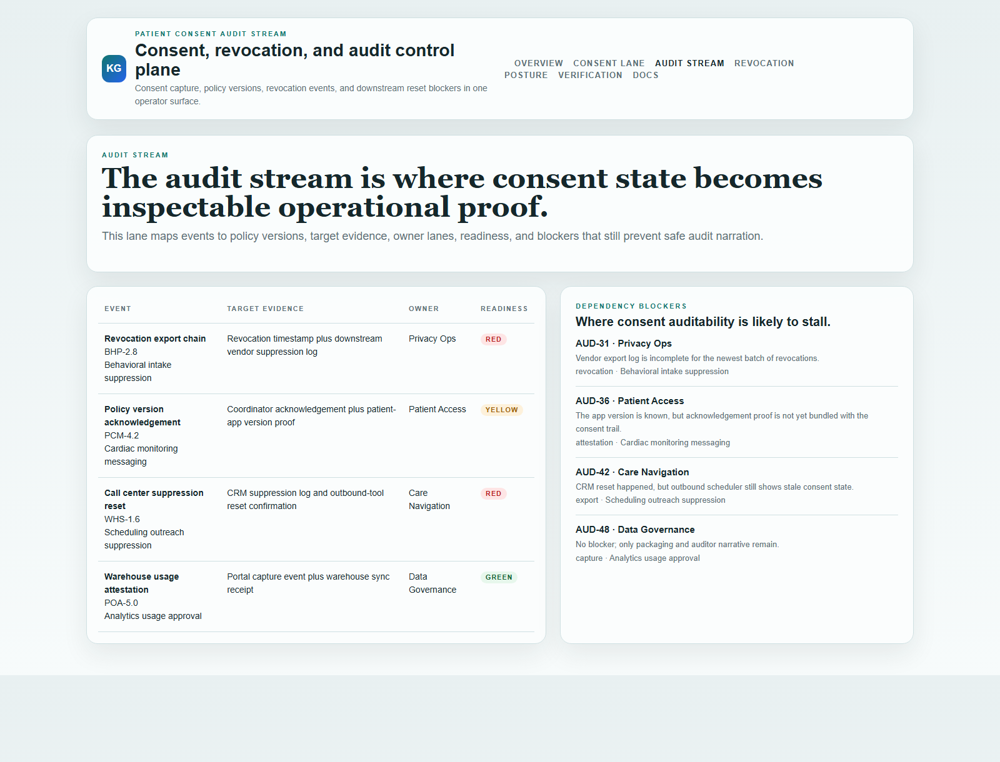
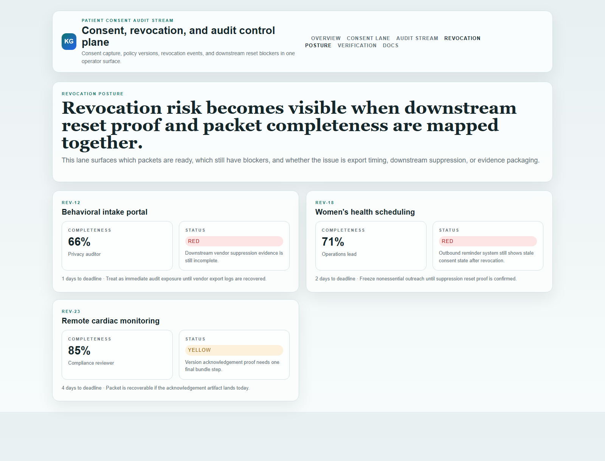

# Patient Consent Audit Stream

[](https://github.com/mizcausevic-dev/patient-consent-audit-stream/actions/workflows/ci.yml)
[](./LICENSE)
[](./.github/dependabot.yml)
[](https://github.com/mizcausevic-dev/patient-consent-audit-stream/actions/workflows/pages.yml)

TypeScript control plane for patient-consent intake, policy version tracking, audit-safe event streams, and revocation-aware escalation across healthcare workflows.

## Why this exists

- Consent programs break when policy versions, capture channels, and downstream usage evidence drift out of sync.
- Audit teams need to know more than whether a checkbox exists; they need proof of when consent was captured, changed, or revoked.
- Revocation events create risk when downstream teams keep acting on stale consent state.
- Digital health buyers care whether consent workflows are inspectable and recoverable under audit, not whether the product claims "trust" in abstract terms.

## Why this matters (KG Embedded tie-back)

This repo demonstrates the audit-stream primitive for Digital Health / MedTech buyers: consent packets tied to policy versions, revocation windows, audit blockers, and operator-safe escalation paths. A B2B SaaS buyer would care because consent state and downstream usage evidence often need to surface inside customer-facing tools without exposing raw PHI systems or unsafe admin write paths. Kinetic Gain Embedded extends this into security-first in-product analytics for consent-aware, policy-aware, and audit-aware reporting across patient and care workflows, see [kineticgain.com/embedded](https://kineticgain.com/embedded).

## Routes

- `/`
- `/consent-lane`
- `/audit-stream`
- `/revocation-posture`
- `/verification`
- `/docs`

## API

- `/api/dashboard/summary`
- `/api/consent-lane`
- `/api/audit-stream`
- `/api/revocation-posture`
- `/api/verification`
- `/api/sample`

## Screenshots






## Local Development

```powershell
cd patient-consent-audit-stream
npm install
npm run dev
```

Open:
- [http://127.0.0.1:5450/](http://127.0.0.1:5450/)
- [http://127.0.0.1:5450/consent-lane](http://127.0.0.1:5450/consent-lane)
- [http://127.0.0.1:5450/audit-stream](http://127.0.0.1:5450/audit-stream)
- [http://127.0.0.1:5450/revocation-posture](http://127.0.0.1:5450/revocation-posture)
- [http://127.0.0.1:5450/verification](http://127.0.0.1:5450/verification)

## Validation

- `npm run build`
- `npm run test`
- `npm run demo`
- `npm run smoke`
- `npm run render:assets`

## Production status

<!-- Maintained by Claude Code (Platform/SRE lane) after v1.0-prod hardening. -->

| Aspect | Status |
|--------|--------|
| CI | Node 20 + 22 matrix — lint · typecheck · coverage · build · demo · smoke · `npm audit` ([workflow](./.github/workflows/ci.yml)) |
| Test coverage | 100% statements on `src/services/` (gate: ≥ 60%) |
| License | [AGPL-3.0-or-later](./LICENSE) |
| Dependencies | Dependabot weekly (npm + GitHub Actions); `npm audit --audit-level=high` in CI |
| Security | [SECURITY.md](./SECURITY.md) — HIPAA-readiness scaffolding; 0 known high/critical advisories at v1.0-prod |
| HIPAA posture | Synthetic sample data only (no PHI). Production use requires a BAA, formal HIPAA review, and qualified medical-data infrastructure — see [SECURITY.md](./SECURITY.md). Do not deploy as-is. |
| Deploy | Static prerender → **https://consent.kineticgain.com/** (GitHub Pages, [pages workflow](./.github/workflows/pages.yml)) |

## Docs

- [Architecture](./docs/architecture.md)
- [Origin](./docs/ORIGIN.md)
- [Kinetic Gain Embedded tie-back](./docs/KINETIC_GAIN_EMBEDDED.md)
- [Changelog](./CHANGELOG.md)
